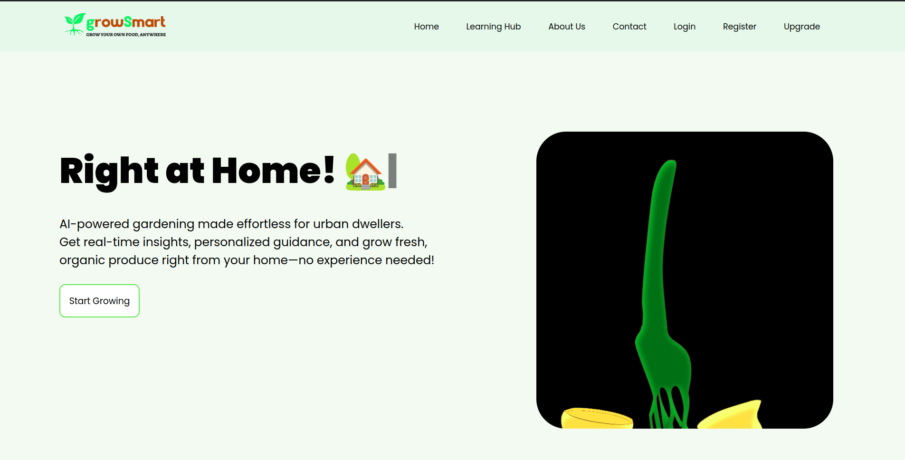
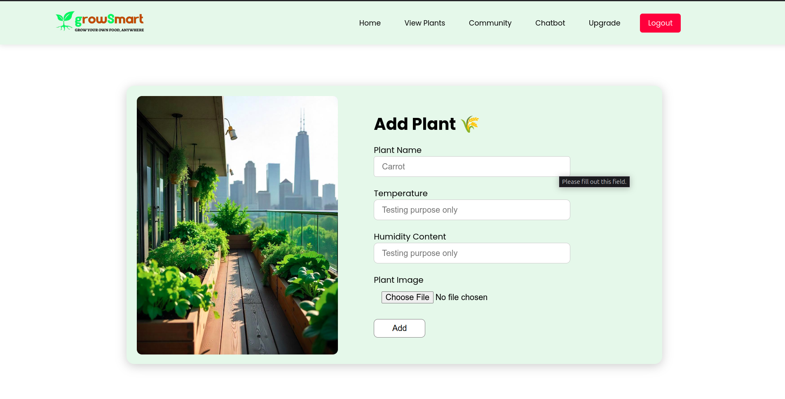
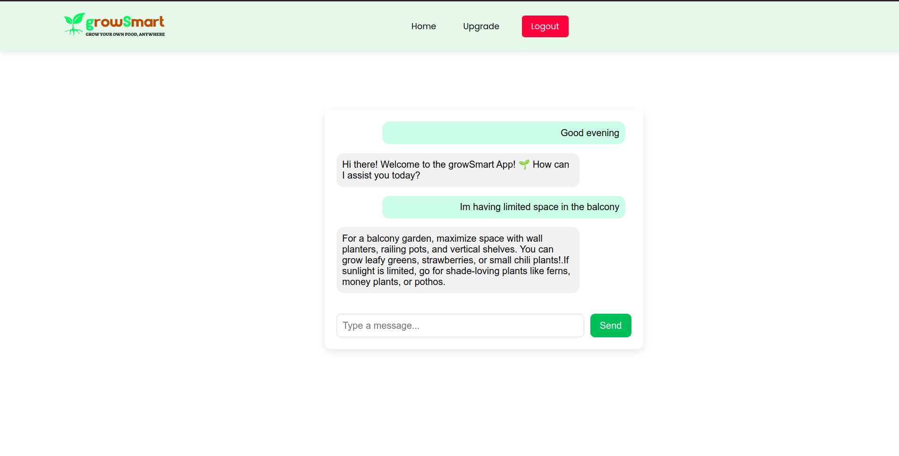

# growSmart App - README

## Overview

growSmart is a smart gardening application designed to help users identify plants and get personalized care tips using the power of AI. The application leverages the Plant.id API for plant identification and Google Dialogflow for an interactive chatbot experience. The backend is built with Flask, providing a robust API, and the frontend is developed with Vue.js, offering a responsive and intuitive user interface.

## Features

*   **Plant Identification:** Identify plants by uploading an image or taking a photo, powered by the Plant.id API.
*   **Smart Chatbot:** Get personalized plant care advice and answers to your gardening questions through a Google Dialogflow-powered chatbot.
*   **User-Friendly Interface:** Enjoy a clean and intuitive interface built with Vue.js.
*   **Secure Backend:** The Flask backend ensures secure and efficient handling of API requests and data management.

## Screenshots









## Tech Stack

*   **Frontend:** Vue.js
*   **Backend:** Flask (Python)
*   **Plant Identification API:** Plant.id API
*   **Chatbot:** Google Dialogflow

## Installation

### Backend (Flask)

1.  **Prerequisites:**
    *   Python 3.7+
    *   pip (Python package installer)

2.  **Clone the repository:**

    ```
    git clone growSmart
    cd growSmart/growSmart-backend  # Navigate to the backend directory
    ```

3.  **Create a virtual environment (recommended):**

    ```
    python3 -m venv venv
    source venv/bin/activate  # On Linux/macOS
    # venv\Scripts\activate  # On Windows
    ```

4.  **Configure environment variables:**

    *   Create a `.env` file in the backend directory.
    *   Add the following variables (replace with your actual credentials):

    ```
    PLANT_ID_API_KEY=YOUR_PLANT_ID_API_KEY
    DIALOGFLOW_PROJECT_ID=YOUR_DIALOGFLOW_PROJECT_ID
    GOOGLE_APPLICATION_CREDENTIALS=path/to/your/google_application_credentials.json
    ```

    **Note:** `GOOGLE_APPLICATION_CREDENTIALS` should point to the service account key file you downloaded from Google Cloud.

5.  **Run the Flask application:**

    ```
    flask run
    ```

    By default, the Flask app will run on `http://127.0.0.1:5000/`.

### Frontend (Vue.js)

1.  **Prerequisites:**
    *   Node.js (v16 or later)
    *   npm (Node Package Manager) or yarn

2.  **Navigate to the frontend directory:**

    ```
    cd ../growSmart-frontend  # Assuming you are in the backend directory
    ```

3.  **Install dependencies:**

    ```
    npm install  # Or yarn install
    ```

4.  **Configure API endpoint:**

    *   In the `src/config.js` or similar file, set the backend API endpoint:

    ```
    const API_ENDPOINT = 'http://localhost:5000'; // Replace if your backend is running elsewhere

    export default API_ENDPOINT;
    ```

5.  **Build the Vue.js application:**

    ```
    npm run build  
    ```

    This will create a `build` directory with a production build of your app.

## Configuration

### Plant.id API

1.  **Sign up for a Plant.id API account:**  Go to [https://plant.id/](https://plant.id/) and create an account.
2.  **Obtain your API key:**  Find your API key in your Plant.id account dashboard.
3.  **Set the `PLANT_ID_API_KEY` environment variable** in the `.env` file in the backend directory.

### Google Dialogflow

1.  **Create a Google Cloud Project:**  Go to [https://console.cloud.google.com/](https://console.cloud.google.com/) and create a new project.
2.  **Enable the Dialogflow API:**  Search for "Dialogflow API" and enable it for your project.
3.  **Create a Dialogflow Agent:**  Go to the Dialogflow console ([https://dialogflow.cloud.google.com/](https://dialogflow.cloud.google.com/)) and create a new agent.
4.  **Create a Service Account:**
    *   Go to the Google Cloud Console IAM & Admin -> Service Accounts page.
    *   Create a new service account.
    *   Grant the service account the "Dialogflow API Client" role.
    *   Download the service account key file in JSON format.
5.  **Set the `DIALOGFLOW_PROJECT_ID` and `GOOGLE_APPLICATION_CREDENTIALS` environment variables** in the `.env` file in the backend directory.  `DIALOGFLOW_PROJECT_ID` should be your Google Cloud Project ID, and `GOOGLE_APPLICATION_CREDENTIALS` should be the path to the downloaded JSON key file.

## Usage

1.  **Start the Flask backend** (following the instructions in the Installation section).
2.  **Start the Vue.js frontend** (following the instructions in the Installation section).
3.  **Open the application in your browser** (usually `http://localhost:8080/`).
4.  **New User - Register.**
5.  **Existing User - Login.**
5.  **Use the Plant Identification feature:**
    *   Upload an image of a plant.
    *   The app will use the Plant.id API to identify the plant and display the results.
6.  **Interact with the Chatbot:**
    *   Type your gardening questions in the chat interface.
    *   The chatbot, powered by Google Dialogflow, will provide relevant answers and plant care advice.

## Contributing

We welcome contributions from the community!  If you'd like to contribute to growSmart, please follow these guidelines:

1.  **Fork the repository.**
2.  **Create a new branch for your feature or bug fix.**
3.  **Make your changes and test them thoroughly.**
4.  **Submit a pull request with a clear description of your changes.**

Please ensure your code follows the project's coding style and includes appropriate tests.


